<div align="center">

<picture>
  <source media="(prefers-color-scheme: dark)" srcset="public/flo-logo-white.png">
  
</picture>

### A point-of-sale built for Pakistani supermarkets

Scan a barcode, take part cash and part JazzCash, hand back change, and know
at 11 pm what should be in the drawer — priced in rupees, searchable in Urdu.

[](https://nextjs.org)
[](https://react.dev)
[](https://www.typescriptlang.org)
[](https://tailwindcss.com)
[](https://supabase.com)
[](LICENSE)

</div>

---

## What Flo is

Flo is a point-of-sale system for supermarkets and kiryana stores in Pakistan —
aisles, barcodes, and a trolley at a counter. It replaces the register book: the
till at the front, the item list behind it, the buying, the returns, the drawer
count at close, and the reports that say whether any of it made money.

It is built for how these shops actually trade. Prices are in rupees. Items
carry an Urdu name you can search on. Haggling Rs 20 off a bill is a control on
the screen, not a workaround. A customer paying part on a card and the rest in
notes is one bill with two tenders. The counter is white and high-contrast,
because dark glass is unreadable under a tube light at 2 pm.

**The repository holds two things:** the public marketing site, and the product
itself — a multi-tenant console at `/app` that a shop signs into.

> **One rule governs the whole product:** the site may only claim what the code
> does. Every screenshot below is generated from the running console by
> `npm run shots`, never mocked up and never retouched. Anything not yet built
> lives on `/roadmap`, named and without an invented date.

---

## Screenshots

### The register

Scan a barcode, or type three letters of the name — English, Urdu or SKU. One
line per item, a running total, a discount button beside it, and a customer
attached from the bill panel. The drawer must be open before anything can be
charged, so every sale lands in a till somebody has counted into.

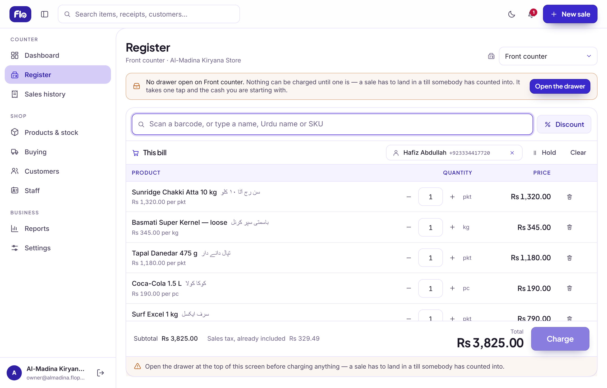

### The dashboard

Sales, profit, cost of goods and margin for the window, each against the period
before it — with the trend by day, the share of takings by department, the top
sellers and the last eight bills.

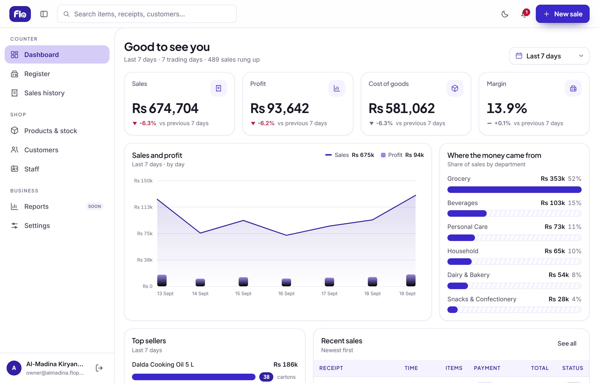

<details>
<summary><b>More of the console</b> — click to expand</summary>

<br>

**Products & stock** — the item list, with cost beside price, the margin worked
out, the shelf count and the low-stock cut.

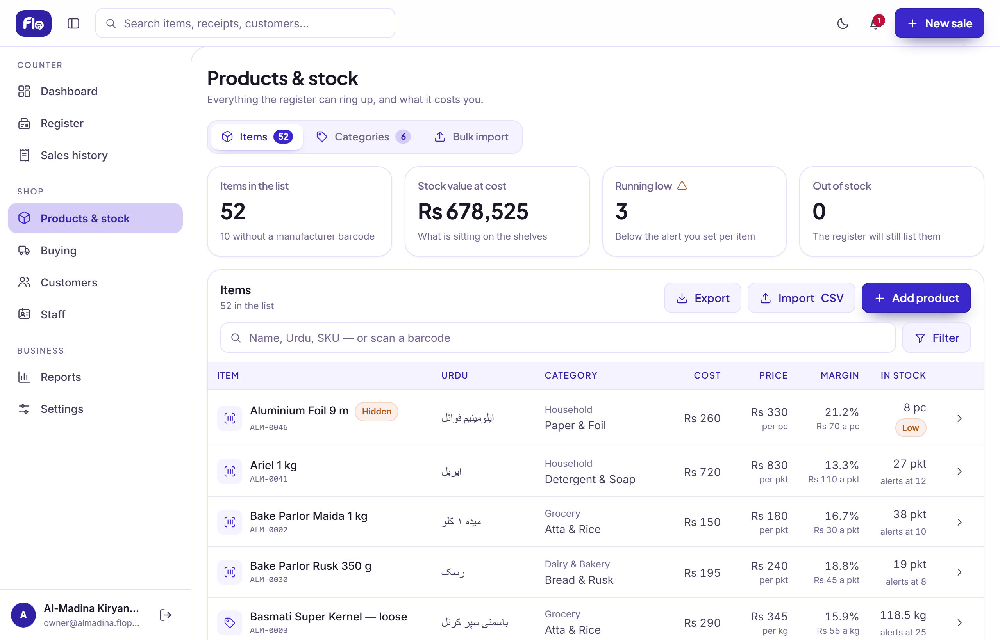

**Sales history** — find last Tuesday's receipt while the customer waits.
Search, narrow, open the bill, reprint it stamped DUPLICATE, or take part of it
back.

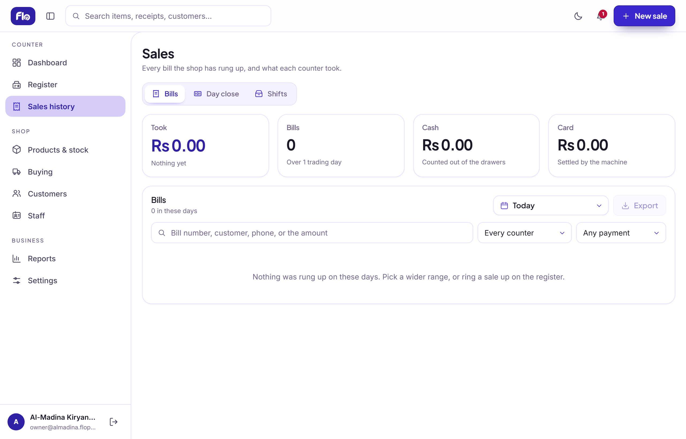

**Day close** — what one counter took between opening and midnight, counted
against what the drawer actually holds.

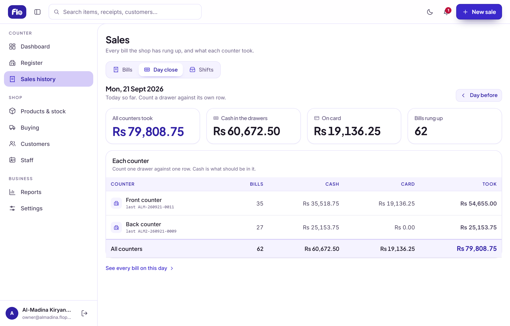

**Reports** — five tabs over one period, and every figure says where it came
from.

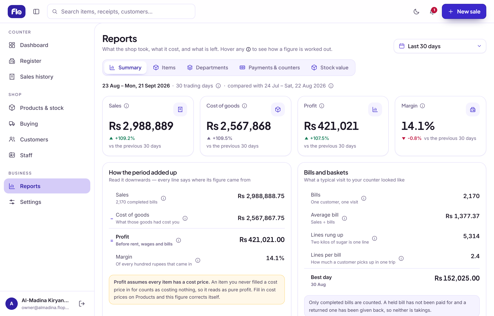

**Buying** — what you ordered, what came in, and what it really cost once the
bhaara is spread across the carton.

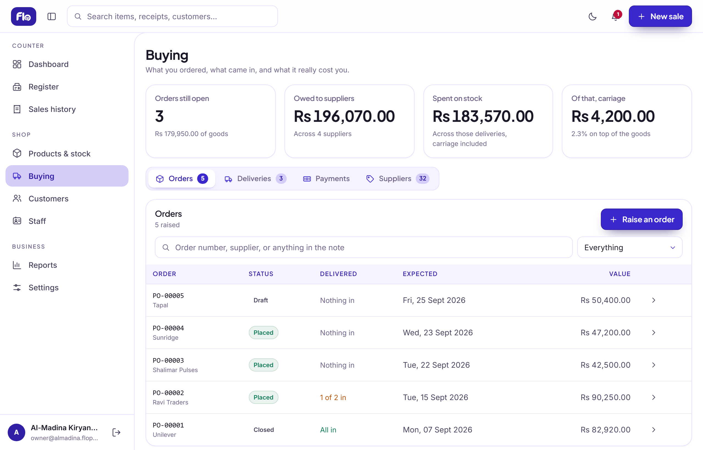

**Customers** — the shop's regulars, keyed on the phone number rather than the
name, with each person's record and their last hundred bills.

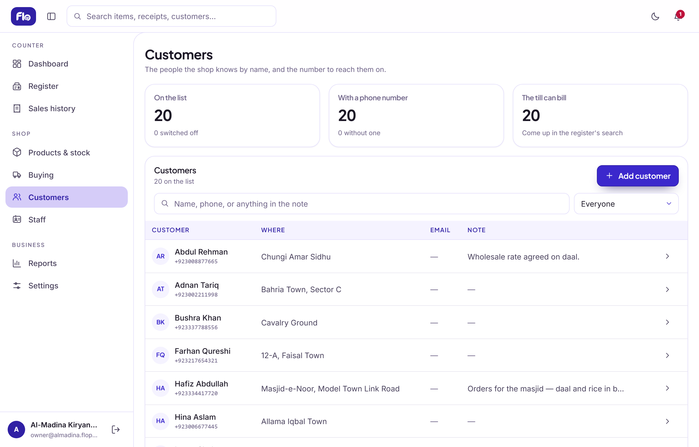

**Your aisles, not ours** — a shop's department and category tree starts empty
and is built from the shop's own words, or grown from the first spreadsheet
import.

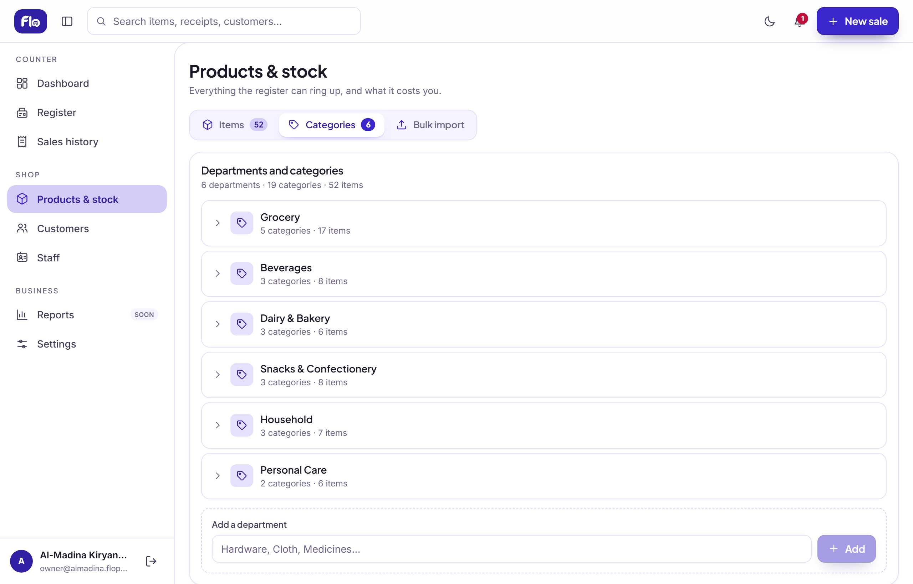

**Staff** — each person signs in as themselves, at an access level the owner
sets.

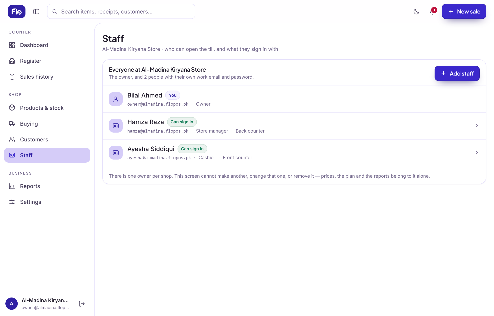

**Settings** — the shop's currency, clock, day-end time, and its counters.

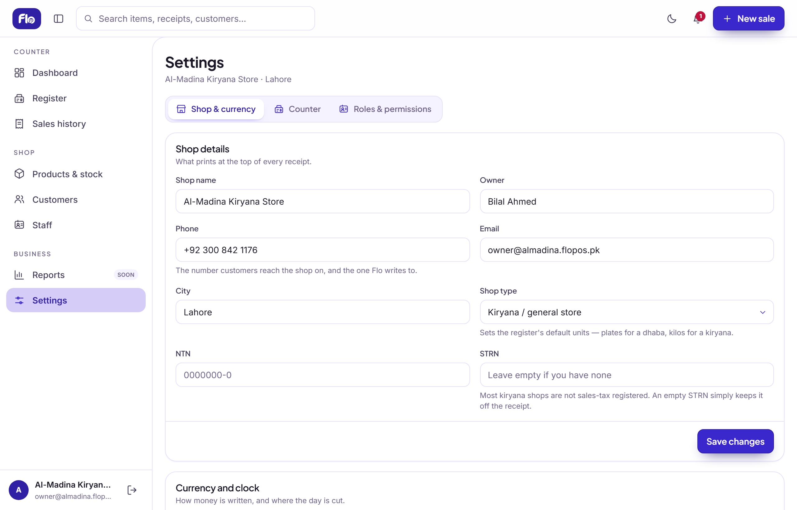

**Roles & permissions** — a cashier sees the till, not the margins. Discounts,
refunds, drawers, stock, buying, customers and reports are switches per access
level.

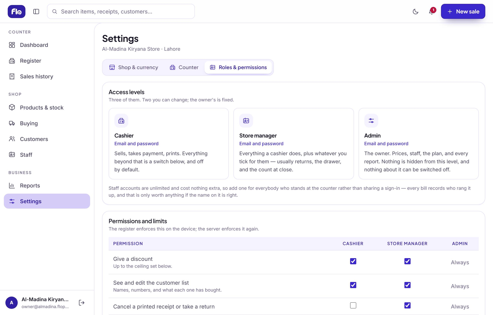

**A night mode that is the same palette** — opt-in per device, from a cookie,
never from the operating system.

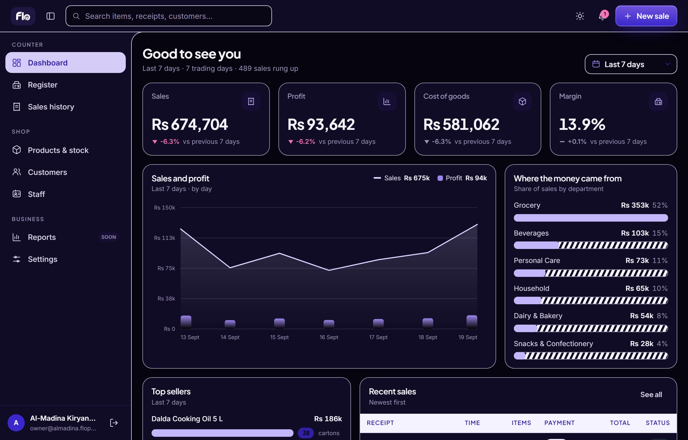

</details>

---

## What it does

### At the counter

- **Scan or search** — barcode, product name, Urdu name or SKU.
- **A discount that is a first-class control**, beside the subtotal where the
  haggling happens. Per cent or rupees, resolved against the cashier's own
  ceiling, clamped and explained rather than refused.
- **Split payments.** Cash, card, Raast, Easypaisa, JazzCash and bank transfer,
  in any combination on one bill, with a reference field for the TID. Cash
  covers the remainder and is never typed. *These record how money arrived —
  Flo does not talk to a wallet or a bank.*
- **A customer on the bill**, attached before the payment sheet opens, and
  always optional — a walk-in is most bills in most shops.
- **Park a bill** and pick it up later. A parked bill claims no receipt number
  and moves no stock.
- **Print on 80 mm.** What is on screen is what comes off the roll. If the save
  fails, the till offers to print anyway — stamped **NOT RECORDED** with an
  unmistakable `UNSAVED-` number, so the shop keeps selling and nothing lies
  about what was counted.
- **Stock is a gate**, not a warning. An item at zero cannot go on a bill.
- **Multi-counter.** Each counter has its own receipt series, its own drawer and
  its own day-end total. Which one a tablet bills from is a device preference.

### Stock and the item list

- **The catalog** — barcode, Urdu name, SKU, cost, selling price, tax rate,
  unit, the shelf count and a per-item low-stock cut.
- **Your own aisles.** Departments and categories, two levels, built from the
  shop's own vocabulary. A new shop starts with an empty tree rather than six
  rows to delete.
- **CSV import that grows with you.** It adds the departments, categories and
  suppliers the file names and the shop does not have yet. Every row goes
  through the same validator the add-product sheet uses, a refused chunk is
  retried row by row so one duplicate barcode never costs the other ninety-nine,
  and every skip is reported by its line number.
- **CSV export** of exactly the rows on screen, with headings the import reads
  back.
- **A stock ledger.** Every movement records what moved, why, against which bill
  and what the count read afterwards. A stocktake works the difference out under
  a lock, so it cannot un-sell what another counter just sold.
- **Batches and expiry**, per item and off by default. Sold first-expired-first.
  An expired batch **cannot** be sold — the way through is a recorded write-off.
  A return goes back into the batch it came from, never a fresh pick.
- **Variants** — two axes (size and colour, say), a price only where it differs
  from the item's, and a grid a thumb can tap. A barcode means exactly one
  thing, enforced across both items and variants.

### Buying

- **Orders and deliveries as separate facts.** An order is an intention; a
  delivery is what turned up. A delivery does not need an order in front of it,
  because most kiryana buying is a van at the door.
- **Landed cost.** Freight and other charges are spread across the lines pro
  rata, to the paisa, and stored — so correcting this week's bhaara never
  rewrites what last month's stock cost.
- **A supplier ledger.** Opening balance, what was invoiced, what was paid, and
  what is still owed — with ageing worked out by walking the deliveries oldest
  first, and the assumption stated on the screen.

### Money and the close

- **Refunds are a sale with a minus in front of them** — partial or whole, at
  what was actually paid after any discount. The original bill is never edited.
  Stock only goes back if the shopkeeper says so, because a burst bag of atta
  does not go on the shelf. The slip prints stamped **REFUND**.
- **Reprints are stamped DUPLICATE**, so a copy cannot be presented twice.
- **Shifts.** A drawer is opened with a float and closed with a count. The
  cashier counts; only somebody with the permission is shown the variance. Both
  figures are recorded either way.
- **Sales history, day close and shifts** — three tabs over one table, because
  they are three different questions. The totals above the table are always the
  totals *of the rows under it*, and the caption says so.

### Knowing what happened

- **A dashboard** of sales, profit, cost and margin against the period before,
  with the trend, the departments, the best sellers and the last eight bills.
- **Five report tabs** — the period's takings, which items made them, which half
  of the shop made them, how it was paid for and by whose till, and what is on
  the shelves. Every figure carries a one-sentence explanation of how it was
  worked out, and the CSV export quotes the same sentence.
- **Profit is real**, because the cost is stamped onto the line at the moment of
  sale. Raising a supplier's price tomorrow does not rewrite last month's
  margins.

### Running the shop

- **Staff with their own sign-in**, at an access level the owner sets.
- **Permissions that mean something.** Discounts, refunds, closing a drawer,
  editing stock, buying, customers and reports are per-level switches — and
  every one is re-checked by the Server Action behind it, because a button the
  browser does not draw is not an endpoint nobody can call.
- **Settings** — shop name, currency, timezone, the hour the trading day ends
  (so a shop that shuts at 1 am gets its last hour on the right day), and the
  counters.
- **A notice bell** derived at render time from rows the console already holds —
  so a notice disappears when its cause is dealt with, and nothing about money
  reaches anybody but the owner.
- **A dark theme** for the console, opt-in per device, re-pointing the same
  tokens at the same brand palette.

### The public site

A marketing site at `/` — home, solutions, products, pricing, roadmap, careers —
plus a demo request form, a signup and checkout flow, and an order lookup at
`/order/[reference]`. Every product claim on it is backed by one of the
screenshots above.

---

## Tech stack

| | |
|---|---|
| **Framework** | Next.js 16 (App Router, Server Components, Server Actions) |
| **UI** | React 19, Tailwind CSS v4 (CSS-first config) |
| **Language** | TypeScript, `strict` |
| **Database** | Supabase — Postgres, Auth, Row Level Security, SQL migrations |
| **Screenshots** | Playwright, driving the real running console |

**Server components by default.** Only a handful of files are `"use client"` —
interactivity is pushed into leaf components rather than up into the page.

---

## Getting started

### Prerequisites

- **Node.js 20.9+**
- A **Supabase** project

### Install

```bash
git clone https://github.com/Taha-Khurram/POS.git
cd POS
npm install
```

### Configure

Copy `.env.example` to `.env.local` and fill it from
**Supabase → Project Settings → API keys**:

```bash
NEXT_PUBLIC_SUPABASE_URL=https://your-project.supabase.co
NEXT_PUBLIC_SUPABASE_PUBLISHABLE_KEY=sb_publishable_...
SUPABASE_SERVICE_ROLE_KEY=sb_secret_...
```

> [!WARNING]
> `SUPABASE_SERVICE_ROLE_KEY` bypasses Row Level Security. It must never be
> prefixed `NEXT_PUBLIC_`, never be imported outside `utils/supabase/admin.ts`,
> and never be committed.

Use the **publishable** key, not the legacy anon key.

### Apply the schema

Migrations are plain SQL in `supabase/migrations/`, applied in filename order.

### Run

```bash
npm run dev
```

Open [http://localhost:3000](http://localhost:3000).

> [!NOTE]
> **Sign-in is deliberately narrow while Flo is in private preview.**
> `app/(auth)/login/actions.ts` holds an `ALLOWED_EMAILS` list checked before
> Supabase verifies the password. Add your address there, or remove the
> constant and its check, to sign in locally.

### Check your setup

```bash
npm run doctor
```

Runs a Supabase preflight — environment, schema, storage bucket and JWT claims.
Worth running first whenever something looks broken, because the costly failures
there are silent: an access-token hook that is switched off makes every RLS
policy see `null` and 404s you out of your own console.

---

## Scripts

| Command | What it does |
|---|---|
| `npm run dev` | Development server |
| `npm run build` | Production build |
| `npm run start` | Serve the production build |
| `npm run lint` | ESLint — flat config, `next/core-web-vitals` + TypeScript |
| `npm run doctor` | Supabase preflight: env, schema, bucket, JWT claims |
| `npm run demo:shop` | Seed (or `--drop`) the demo shop the screenshots are taken from |
| `npm run shots` | Photograph the running console into `public/shots/` |

### About `npm run shots`

It drives a live `npm run dev` and writes thirteen PNGs of the real console,
signed in as the self-contained demo shop `npm run demo:shop` builds — so no
screenshot ever carries a real person's email.

The `SHOTS` list in `scripts/shots.mjs` is the contract: a screen not on it has
no photograph, and a claim on the site with no photograph behind it is copy
nobody has checked against the product. **Re-run it after any change to how
`/app` looks.**

One-time setup: `npx playwright install chromium`.

---

## Project structure

```
app/
  layout.tsx            html, body and fonts only — chrome belongs to the group
  (site)/               public marketing routes, with Nav and Footer
  (auth)/login/         sign-in, in its own group so it gets neither
  (app)/app/            the product: register, stock, buying, reports, settings
  not-found.tsx         above the groups, so it carries its own chrome

components/
  site/                 page sections and site chrome
  pos/                  console components
  motion/               Reveal, CountUp, Tilt and the hooks behind them

lib/
  auth.ts               session claims and the /app gate
  entitlements.ts       the single authority on what a plan allows
  pos/                  domain logic — catalog, counter, reports, batches, …

utils/supabase/         client (browser), server, middleware, admin (service role)
supabase/migrations/    plain SQL, applied in filename order
public/shots/           generated console screenshots — never edited by hand
proxy.ts                refreshes the session cookie on every non-static path
```

`@/*` maps to the repository root.

> Next.js 16 renamed `middleware.js` to `proxy.js`, and the export is `proxy`.

---

## Architecture notes

<details>
<summary><b>Multi-tenancy and access control</b></summary>

<br>

Every business table carries `tenant_id uuid not null`, with RLS enabled and
forced from the same migration that creates it. Five rules every migration
inherits:

1. **RLS reads JWT claims, never a subquery.** An access-token hook stamps
   `tenant_id`, `tenant_role` and `branch_id`; policies read them through helper
   functions wrapped in `(select …)`, so they evaluate once per statement rather
   than once per row.
2. **Tenant users get `select` policies only.** There is no insert, update or
   delete policy anywhere, and those privileges are revoked outright. Every
   write goes through the service role inside a Server Action, so there is one
   auditable path.
3. **Write paths never carry a support escape hatch.** Read-only access may;
   anything that writes may not.
4. **`audit_log` is append-only**, enforced by a trigger rather than by policy.
5. **Permission is checked twice** — once to decide what to draw, and again in
   the Server Action that acts on it.

An account is re-verified against its own profile row on each gated request,
because an access token is self-contained: deleting or suspending somebody stops
the next sign-in but leaves the token already in the tablet valid until it
expires. That check fails *open*, because an unreachable database is not
evidence that anybody was sacked.

</details>

<details>
<summary><b>Why some numbers are stored and others are not</b></summary>

<br>

**Stored, because rewriting history is worse than duplicating it:** a sale
line's cost and name at the moment it was rung up (a bill is what happened), a
delivery line's landed cost (correcting the freight must not rewrite last
month's margins), and a shift's expected cash (a refund next Tuesday must not
restate what a drawer was short by last week).

**Derived every time, because a second copy is the one that drifts:** how much
of an order has arrived, what a supplier is owed, the ageing buckets behind it,
and every figure on the reports. A stored counter saying a shop is owed forty
bottles it took last week is worse than the read it costs to count them.

**Money nets; counts do not.** A refund is a negative sale row, so it nets out
of the takings, the dashboard and all five report tabs by arithmetic rather than
by each of them remembering to subtract it — but the shop still served that
customer twice, so bill *counts* only ever include the positive rows.

**The browser never decides what anything costs.** The till sends item ids and
quantities; the server re-prices every line from the catalog, re-resolves the
discount against the cashier's ceiling, and recomputes the total before the
write.

</details>

<details>
<summary><b>Styling</b></summary>

<br>

Tailwind v4, CSS-first. All tokens live in the `@theme` block of
`app/globals.css` and all reusable classes in `@layer components` — read that
file before writing any styles.

**Two visual languages.** The marketing site is dark glass. `/app` is light and
high-contrast, because that is what is readable under a tube light at 2 pm. The
console's opt-in dark theme works by re-pointing its own tokens at the site's
palette, so the night console and the marketing page are one brand by
construction.

That only holds because **colour belongs in a token, not in a component** — a
hard-coded hex in a `.tsx` file survives the theme flip.

</details>

---

## Verification

There are no automated tests and no CI. `npm run lint` and `npm run build` are
the verification gates, and both must be green:

```bash
npm run lint && npm run build
```

`tsc` has no script of its own — type errors surface through `next dev` and
`next build`.

A pgTAP suite once proved the five RLS rules above and was removed when the
local Postgres that ran it became unavailable; it is recoverable from git
history. Until it returns, **a migration that adds a business table has to be
read against those five rules by hand.**

---

## Documentation

| File | What is in it |
|---|---|
| [`CLAUDE.md`](CLAUDE.md) | The full engineering guide — every convention, and the reasoning behind each one |
| [`Plan.md`](Plan.md) | The order the modules arrive in |
| [`PRODUCT-REPORT.md`](PRODUCT-REPORT.md) | The before-and-after audit of what the site claimed against what the code does |
| [`VERIFICATION.md`](VERIFICATION.md) | Manual verification notes |
| [`AGENTS.md`](AGENTS.md) | A note that this Next.js version differs from older App Router conventions |

---

## Roadmap

`/roadmap` on the site is the live list — named, ordered, and without invented
dates. Not built today: offline billing (the outbox exists in the schema and
nothing writes it), a sales-tax summary (a line records the price it sold at and
not the rate behind it, so any figure would be reverse-engineered), FBR digital
invoicing, and multi-branch.

**Restaurant mode is not coming.** It was built, and then removed in full. Flo
is a supermarket till and only that — a dining room is a different product.

---

## License

Copyright © 2026 Taha Khurram. All rights reserved.

Flo is **proprietary commercial software**. Access to this repository does not
grant any right to use, copy, modify or distribute it. See [LICENSE](LICENSE).

Licensing enquiries: khurram@complya.com
